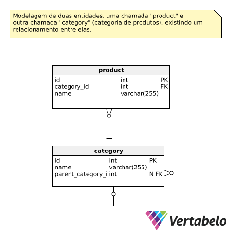

# Teste Prático (Back-end)

Esta é uma aplicação que serve de base para avaliação de nossos candidatos.

Neste teste específico, temos como finalidade avaliar seus conhecimentos nos seguintes tópicos:

* Lógica de Programação
* Java
* Spring Framework
* REST
* Manipulação de dados
* Testes
* Maven

Ela foi desenvolvida utilizando *Spring Boot* e esta preparada para realizar a carga de dados (banco de dados H2) através dos arquivos **schema.sql** (DDL) e **data.sql** (carga).

Para executar a aplicação basta utilizar o seguinte comando:

	mvn spring-boot:run

## Objetivos

Para alcançar os resultados esperados dessa avaliação, você tem total liberdade para desenvolver da maneira que preferir. Você também é livre para utilizar os frameworks, padrões de projeto e tecnologias que melhor se adapte. Só não se esqueça que, ao final do desenvolvimento, a aplicação terá que cumprir com os objetivos listados a seguir:

#### 1) Modelagem de dados

Você deverá modelar duas entidades, uma chamada **product** e outra chamada **category** (categoria de produtos), sendo que deverá existir um relacionamento entre elas.

#### 2) Serviços REST

A aplicação deverá expor os seguintes serviços REST:

* Listagem de todas as categorias de produtos

	http://localhost:8080/api/category/listAll

* Listagem de todos os produtos filtrados por categoria

	http://localhost:8080/api/product/listByCategory/{categoryId}

#### 3) Testes

Ao final, todos os JUnits que estão disponíveis nesse projeto deverão executar com sucesso.

## Desafios Bônus

Serão considerados como um diferencial em sua avaliação, a implementação de ao menos um dos seguintes desafios:

* Percentual elevado de cobertura de testes com cenários não implementados :)
* Criação de um serviço adicional para consulta da categoria com a maior ocorrência de uma determinada letra em seu nome. Por exemplo, se tivermos a categoria **Brinquedos** e a categoria **Medicamentos** e eu chamar este serviço passando como parâmetro a letra "e" o retorno do serviço deverá ser a categoria **Medicamentos** :D
* Execução de testes unitários e integrados em ciclo de build distintos ¯\\_(ツ)_/¯

>
> Any fool can write code that a computer can understand. Good programmers write code that humans can understand.
> – Martin Fowler
>

------

## Registro de Decisões

Aqui estão registradas as decisões tomadas durante a implementação do projeto:

- [08/08/19 - 22:12] - Troca do formato do arquivo de configurações do Spring Boot, de *properties* para *[YAML](https://yaml.org/)* com objetivo de facilitar a leitura.
- [08/08/19 - 22:25] - Criação de auto relacionamento na entidade **Category** para representar uma hierarquia de categorias, padrão em sistemas que lidam com produtos e suas categorias.
- [08/08/19 - 22:26] - Inclusão da propriedade **h2:console:enable** para habilitar o console web do H2.
- [08/08/19 - 22:44] - Adoção da biblioteca Lombok para redução do código, evitando criar métodos construtores, getters e setters.
- [08/08/19 - 22:45] - Alteração da propriedade **ddl-auto: create-drop**  para **ddl-auto: none** para evitar que o hibernate recrie a base (criada via script).

## Arquitetura do Software

Esta seção provê uma visão geral da arquitetura do software.

#### Modelo Entidade Relacionamento (modelo ER)

